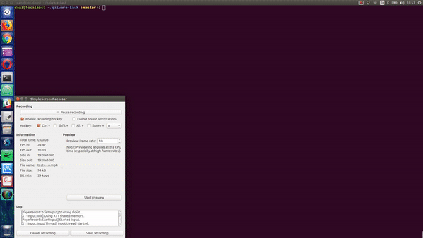

# QaiWare QA Technical Task - Daniel Varbanov

The project uses test framework Nightwatch.js based on Node.js and it runs against Selenium WebDriver for Chrome (ChromeDriver).

Tested website: http://www.phptravels.net/

## Setup

- Clone this repository:
```bash
$ git clone https://github.com/dvarbanov/qaiware-task.git
```

- Install Java (required by Selenium)

- Install Node.js

- Install required project dependencies with npm:
  - selenium-server
  - chromedriver
  - nightwatch

```bash
$ npm install
```

## Run
Run the Nightwatch tests:
```bash
$ npm run tests
```

## File structure
- ./tests
    - Tests are located in this folder
    - Each test has access to the Nightwatch API: http://nightwatchjs.org/api
- ./test-scenarios - test scenarios described in Gherkin
- ./reports - logs after testing
- ./screenshots - made on test failure
- ./globals.js - global variables

## Test Execution Demo


